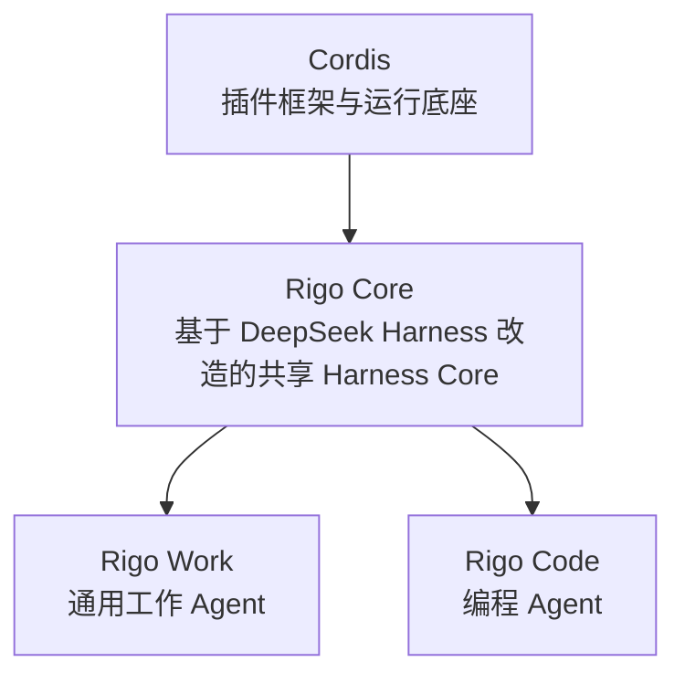
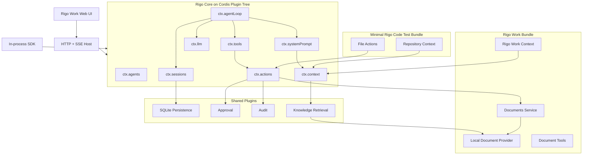
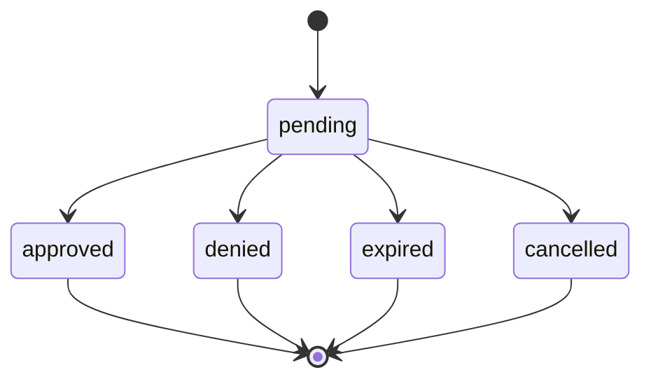

# SPEC：Rigo

> Technical specification derived from: `tasks/prd-work-and-code-harness.md`  
> Generated: 2026-08-25  
> Updated: 2026-08-26
> Target branch: `main`  
> Base commit: `e173d5b`

## 1. Summary

### 1.1 What This SPEC Covers

本 SPEC 定义 Rigo MVP 的技术架构、上游复刻边界、包结构、插件契约、数据模型、HTTP/SSE API、Agent 状态机、知识检索、文档 Action、审批、审计、安全、测试和实施顺序。

系统以 `@teoclub/cordis` 为插件框架与运行底座，复刻 DeepSeek Harness 的领域无关控制主干并改造为 Rigo Core，通过 Rigo Work Bundle 和最小 Rigo Code 测试 Bundle 验证同一 Rigo Core 可以服务不同领域。

### 1.2 PRD Reference

- Source: `tasks/prd-work-and-code-harness.md`
- User Stories: US-001—US-018
- Functional Requirements: FR-1—FR-38
- Non-functional Requirements: NFR-1—NFR-10

### 1.3 Design Decisions Summary

| Decision | Choice | Rationale |
|---|---|---|
| 工程与产品命名 | Rigo / Rigo Core / Rigo Work / Rigo Code | Rigo 是正式工程名；Core 是共享 Harness Core；Work 与 Code 是两个领域 Agent |
| npm 命名空间 | Core：`@teoclub/harness-*`；Work：`@teoclub/work-*` | 保留技术分类命名，不在 MVP 执行二次品牌化改名 |
| 上游基线 | `dsh-v0.1.1-rc.2` / `b150a551...` | 截至生成日期，官方 Git 仓库最高 SemVer Release Tag；与当前 Cordis 复刻提交一致 |
| 上游同步 | 手动选择官方 Release Tag | 固定 Tag 并审计后升级，禁止自动跟随 `master` |
| 迁移策略 | 先 Fork 验证，再选择性迁移 | 先证明行为，再控制长期依赖闭包 |
| 插件内核 | `@teoclub/cordis` | 当前仓库已经完成复刻、测试和双运行时验证 |
| 包兼容性 | 保持行为语义，不保持 `@deepseek-ai/dsh-*` 包名 | 避免被上游产品命名与配置绑定 |
| Session 存储 | 仅提供 SQLite Provider，使用仅追加事件表 | 本地优先、事务性、易恢复和查询；MVP 不交付 JSONL Provider |
| SQLite Provider | Node 24 `node:sqlite` 独立插件 | 无额外原生依赖；通过 Provider 隔离 API 变化风险 |
| 本地检索 | SQLite FTS5 | 可确定测试、部署简单；Vector Provider 后续接入 |
| 文档工作区 | 每个 Session 一个 Workspace Root | 路径边界明确，易于实现越界检查与审计 |
| 文档格式 | Markdown 和纯文本读写 | 控制 MVP 解析和写入复杂度；PDF、图片和 Office 不在范围内 |
| Web 接入 | 精简 React/Vite UI + HTTP/SSE | 不引入上游复杂 Host/Client/Typert 闭包 |
| Headless 接入 | 进程内 SDK + HTTP/SSE | 两者共用同一 Runtime Facade，同时支持嵌入式和网络式接入 |
| Rigo Code 验证 | 最小 Rigo Code Bundle | 验证 Rigo Core 无 Rigo Work 依赖，不交付完整 Rigo Code 产品 |
| 写操作 | Policy → Approval → Action → Audit | 默认读取自动、写入需审批 |
| UI 数据源 | Session/Agent Events | UI 不直接消费原始 LLM Provider Stream |

## 2. Architecture

### 2.1 System Context



Rigo Core 通过 Cordis 的 Context、Service、Fiber 和插件树获得组合与生命周期能力。Rigo Work 与 Rigo Code 仅共享 Rigo Core，领域插件、Provider、Bundle 和产品界面保持分离。

MVP 运行拓扑：



### 2.2 Architectural Layers

#### Layer 0：Cordis Runtime

负责：

- Context 和 Service
- 插件注册
- `inject`
- Fiber 生命周期
- Typed Events
- Reversible Effects
- Loader、Include、Group 和 HMR

不得包含 Agent、Rigo Work 或 Rigo Code 领域逻辑。

#### Layer 1：Rigo Core

包含每次 Agent Turn 必需的领域无关能力：

- Protocol
- Scope
- Session
- System Prompt
- Context Assembly
- LLM Registry
- Tool Registry
- Agent API
- Agent Loop
- App Boot

Rigo Core 不得导入 `packages/work` 或 `packages/code`。

#### Layer 2：Shared Plugins

包含跨领域但非每个 Turn 必需的能力：

- SQLite Persistence
- Actions
- Approval
- Audit
- Knowledge Retrieval
- HTTP/SSE Host
- SDK

#### Layer 3：Domain Bundles

Rigo Work Bundle：

- Rigo Work Context
- Local Documents
- SQLite FTS Knowledge
- Document Read/Write Actions
- Rigo Work Web UI

Minimal Rigo Code Bundle：

- Repository Context Contributor
- Workspace File Read Action
- Workspace File Write Action
- 不包含 Shell、Git、LSP 或 Sandbox

#### Layer 4：Surfaces

- Rigo Work Web UI
- HTTP/SSE API
- In-process SDK
- 测试用 Headless Runner

### 2.3 Upstream Package Mapping

| Upstream | Local Target | Strategy |
|---|---|---|
| `dsh-scope` | `@teoclub/harness-scope` | KEEP + rescope |
| `dsh-session` | `@teoclub/harness-session` | KEEP + persistence adaptation |
| `dsh-system-prompt` | `@teoclub/harness-system-prompt` | KEEP |
| `dsh-tools` | `@teoclub/harness-tools` | KEEP + Action bridge |
| `dsh-agent` | `@teoclub/harness-agent` | KEEP |
| `dsh-agent-default-model` | `@teoclub/harness-agent-default-model` | KEEP |
| `dsh-agent-loop` | `@teoclub/harness-agent-loop` | KEEP first, adapt later |
| `dsh-llm` | `@teoclub/harness-llm` | KEEP |
| `dsh-app-boot` | `@teoclub/harness-app-boot` | ADAPT |
| `dsh-session-persistence` | `@teoclub/harness-session-persistence` | KEEP |
| `dsh-settings` | `@teoclub/harness-settings` | Minimal subset |
| `dsh-invariants` | `@teoclub/harness-invariants` | KEEP for tests |
| `dsh-base` | `@teoclub/work-base` | REPLACE |
| Coding packages | Minimal Rigo Code Bundle | REPLACE |

基线来源：[DeepSeek Harness `dsh-v0.1.1-rc.2`](https://github.com/deepseek-ai/deepseek-harness/tree/dsh-v0.1.1-rc.2)。

### 2.4 Service Contracts

| Context Key | Owner | Contract |
|---|---|---|
| `ctx.sessions` | Harness Session | Session 创建、恢复、事件追加和派生 |
| `ctx.systemPrompt` | System Prompt | Prompt Section 和 Tool Schema 组装 |
| `ctx.context` | Context Assembly | 领域上下文贡献器注册与执行 |
| `ctx.llm` | LLM Registry | Provider 注册和流式请求 |
| `ctx.tools` | Tool Registry | 模型可见 Tool 注册和执行 |
| `ctx.actions` | Action Pipeline | 领域动作、审批、幂等和审计 |
| `ctx.agents` | Agent Registry | Agent 创建、查找、恢复和释放 |
| `ctx.agentLoop` | Default Loop | Agent Factory 和默认状态机 |
| `ctx.approvals` | Approval Service | 审批创建、决定、恢复和过期 |
| `ctx.knowledge` | Knowledge Service | 索引和检索 Provider |
| `ctx.documents` | Documents Definition | 文档读取、版本检查和原子写入 |
| `ctx.audit` | Audit Service | 脱敏审计事件 |

### 2.5 Dependency Rules

- Domain Plugin 可以依赖 Rigo Core 和 Shared Service Definition。
- Domain Plugin 不得依赖其他领域的 Provider。
- UI、HTTP 和 SDK 只依赖 `ctx.agents`、Session Event 与 Approval API。
- Agent 扩展只依赖 `ctx.agents`，不得导入默认 Agent Loop。
- Tool 是模型可见 Consumer；业务副作用由 Action 执行。
- Knowledge Provider 不得直接写入 System Prompt。
- Context Contributor 可以消费 Knowledge Service。
- Rigo Core 不得导入 React、HTTP、SQLite、Rigo Work 或 Rigo Code 包。
- SQLite Provider 为 Node-only；其 Service Definition 保持运行时无关。
- Rigo Core 与 Cordis 包继续通过 Node 和 Bun 测试。
- Rigo Work Reference App 以 Node 24 为生产运行时。

### 2.6 Proposed File Structure

```text
packages/
├── harness/
│   ├── protocol/
│   ├── scope/
│   ├── session/
│   ├── session-persistence/
│   ├── system-prompt/
│   ├── context/
│   ├── llm/
│   ├── llm-openai-compatible/
│   ├── tools/
│   ├── agent/
│   ├── agent-default-model/
│   ├── agent-loop/
│   ├── invariants/
│   └── app-boot/
├── shared/
│   ├── storage-sqlite-node/
│   ├── actions/
│   ├── approvals/
│   ├── audit/
│   ├── knowledge/
│   └── knowledge-sqlite-fts/
├── work/
│   ├── context/
│   ├── documents/
│   ├── documents-local/
│   ├── tool-document-read/
│   ├── tool-document-write/
│   └── ui-api/
├── code/
│   ├── context-repository/
│   └── file-actions/
├── api/
│   ├── http/
│   └── sdk/
└── bundle/
    ├── work-base/
    └── code-minimal/

apps/
├── work-server/
└── work-web/

examples/
├── harness-spine/
└── code-minimal/

tests/
├── upstream/
├── compatibility/
├── integration/
├── package/
└── e2e/

docs/
├── harness-upstream.md
├── harness-upstream.manifest.md
└── harness-upstream-audit.json
```

根工作区增加：

```text
packages/harness/*
packages/shared/*
packages/work/*
packages/code/*
packages/api/*
packages/bundle/*
apps/*
```

## 3. Data Model

### 3.1 ID Conventions

使用带前缀的 UUID：

```text
session_<uuid>
turn_<uuid>
step_<uuid>
approval_<uuid>
action_<uuid>
document_<uuid>
audit_<uuid>
```

TypeScript 使用 branded string，运行时仍为普通字符串。

### 3.2 Session Tables

```sql
CREATE TABLE sessions (
  id TEXT PRIMARY KEY,
  status TEXT NOT NULL CHECK (status IN ('active', 'closed')),
  provider_id TEXT NOT NULL,
  model_id TEXT NOT NULL,
  title TEXT,
  workspace_root TEXT NOT NULL,
  metadata_json TEXT NOT NULL DEFAULT '{}',
  created_at TEXT NOT NULL,
  updated_at TEXT NOT NULL
);

CREATE TABLE session_events (
  session_id TEXT NOT NULL,
  seq INTEGER NOT NULL,
  type TEXT NOT NULL,
  turn_id TEXT,
  step_id TEXT,
  schema_version INTEGER NOT NULL,
  payload_json TEXT NOT NULL,
  created_at TEXT NOT NULL,
  PRIMARY KEY (session_id, seq),
  FOREIGN KEY (session_id) REFERENCES sessions(id)
);

CREATE INDEX idx_session_events_turn
  ON session_events(session_id, turn_id, seq);
```

`session_events` 是模型可见历史和执行回放的事实源。

### 3.3 Approval Tables

```sql
CREATE TABLE approvals (
  id TEXT PRIMARY KEY,
  session_id TEXT NOT NULL,
  action_execution_id TEXT NOT NULL UNIQUE,
  state TEXT NOT NULL CHECK (
    state IN ('pending', 'approved', 'denied', 'expired', 'cancelled')
  ),
  request_json TEXT NOT NULL,
  version INTEGER NOT NULL DEFAULT 1,
  created_at TEXT NOT NULL,
  expires_at TEXT NOT NULL,
  decided_at TEXT,
  decision_json TEXT,
  FOREIGN KEY (session_id) REFERENCES sessions(id)
);
```

状态修改使用：

```sql
UPDATE approvals
SET state = ?, decision_json = ?, decided_at = ?, version = version + 1
WHERE id = ? AND state = 'pending' AND version = ?;
```

受影响行数不是 1 时返回冲突。

### 3.4 Action Execution Tables

```sql
CREATE TABLE action_executions (
  id TEXT PRIMARY KEY,
  session_id TEXT NOT NULL,
  turn_id TEXT,
  step_id TEXT,
  action_name TEXT NOT NULL,
  side_effect TEXT NOT NULL CHECK (
    side_effect IN ('none', 'local-read', 'local-write', 'external-write')
  ),
  state TEXT NOT NULL CHECK (
    state IN (
      'proposed',
      'awaiting-approval',
      'running',
      'succeeded',
      'failed',
      'cancelled',
      'recovery-required'
    )
  ),
  idempotency_key TEXT NOT NULL,
  request_json TEXT NOT NULL,
  result_json TEXT,
  error_json TEXT,
  created_at TEXT NOT NULL,
  started_at TEXT,
  finished_at TEXT,
  UNIQUE(action_name, idempotency_key),
  FOREIGN KEY (session_id) REFERENCES sessions(id)
);
```

同一 `action_name + idempotency_key`：

- 已成功：返回已有结果。
- 正在运行：返回当前状态。
- 请求内容不同：返回 `IDEMPOTENCY_CONFLICT`。
- 已失败：不得自动重新产生副作用；调用方必须创建新键。

### 3.5 Document Tables

```sql
CREATE TABLE documents (
  id TEXT PRIMARY KEY,
  relative_path TEXT NOT NULL UNIQUE,
  version INTEGER NOT NULL,
  content_hash TEXT NOT NULL,
  media_type TEXT NOT NULL,
  size_bytes INTEGER NOT NULL,
  indexed_version INTEGER,
  updated_at TEXT NOT NULL
);
```

MVP 支持：

- `text/markdown`
- `text/plain`
- 单文档最大 5 MiB
- Workspace 总索引目标不超过 1 GiB

### 3.6 Knowledge Tables

```sql
CREATE TABLE knowledge_chunks (
  id INTEGER PRIMARY KEY,
  document_id TEXT NOT NULL,
  document_version INTEGER NOT NULL,
  ordinal INTEGER NOT NULL,
  title TEXT NOT NULL,
  body TEXT NOT NULL,
  location_json TEXT NOT NULL,
  UNIQUE(document_id, document_version, ordinal),
  FOREIGN KEY (document_id) REFERENCES documents(id)
);

CREATE VIRTUAL TABLE knowledge_fts USING fts5(
  title,
  body,
  content='knowledge_chunks',
  content_rowid='id',
  tokenize='unicode61'
);
```

查询使用 FTS5 BM25，排序规则：

1. BM25 分数
2. 文档 ID
3. Chunk Ordinal

相同输入必须产生确定性顺序。

### 3.7 Audit Model

Session 范围内的审计事实写入 `session_events`，不再建立第二份事实日志。

审计服务负责：

- 脱敏
- 规范化事件
- 写入 Session Event
- 生成 UI Projection

必须记录：

- Retrieval Query 摘要和 Source IDs
- Approval Request 和 Decision
- Action 状态变化
- 文档版本变化
- Agent Error 和 Abort

### 3.8 Migration Strategy

- 使用顺序 SQL Migration 文件。
- 数据库记录 `schema_migrations(version, applied_at, checksum)`。
- Migration 在插件树启动前执行。
- Migration 失败时不得启动 Agent Runtime。
- 已应用 Migration 不允许内容变化。
- MVP 不提供降级 Migration；回滚通过关闭新版本并恢复数据库备份完成。
- 每次 Schema 变更前创建一致性备份。
- Session Event Payload 通过 `schema_version` 进行向前迁移。

## 4. API Design

### 4.1 Transport

- Web Host 使用 Node 24。
- UI 与 API 同源。
- JSON 请求使用 `/api/v1/*`。
- 实时事件使用 SSE。
- Headless SDK 直接调用相同的 Runtime Facade。
- MVP 不提供 JSON-RPC。
- 服务默认只监听 `127.0.0.1`。

### 4.2 Endpoints

| Method | Path | Description |
|---|---|---|
| `GET` | `/api/v1/health` | Runtime 与数据库健康状态 |
| `POST` | `/api/v1/sessions` | 创建 Session 和 Agent |
| `GET` | `/api/v1/sessions/:id` | 获取 Session Projection |
| `DELETE` | `/api/v1/sessions/:id` | 关闭并释放 Agent |
| `POST` | `/api/v1/sessions/:id/messages` | 发送用户消息 |
| `POST` | `/api/v1/sessions/:id/abort` | 取消当前活动 |
| `GET` | `/api/v1/sessions/:id/events` | SSE 事件流 |
| `GET` | `/api/v1/sessions/:id/approvals` | 获取待审批请求 |
| `POST` | `/api/v1/approvals/:id/decision` | 批准或拒绝 |
| `GET` | `/api/v1/sessions/:id/audit` | 获取审计 Projection |

### 4.3 Create Session

Request：

```json
{
  "providerId": "openai-compatible",
  "modelId": "default",
  "workspaceRoot": "/absolute/workspace/path",
  "title": "Quarterly report"
}
```

Response `201`：

```json
{
  "session": {
    "id": "session_<uuid>",
    "status": "active",
    "agentStatus": "idle",
    "providerId": "openai-compatible",
    "modelId": "default",
    "title": "Quarterly report",
    "lastSeq": 0
  }
}
```

Validation：

- `workspaceRoot` 必须为绝对路径。
- 路径必须存在且为目录。
- Provider 和 Model 必须存在。
- Title 最大 200 个 Unicode Code Points。

### 4.4 Send Message

Request：

```json
{
  "clientMessageId": "client-generated-id",
  "content": [
    {
      "type": "text",
      "text": "根据知识库更新项目总结"
    }
  ]
}
```

Response `202`：

```json
{
  "turnId": "turn_<uuid>",
  "status": "accepted"
}
```

规则：

- `clientMessageId` 在 Session 内唯一。
- 重复提交返回原 Turn ID。
- 文本总长度最大 1 MiB。
- Session 已有活动 Turn 时进入 Agent Inbox，不直接开启冲突 Turn。

### 4.5 SSE Event Stream

Request：

```http
GET /api/v1/sessions/session_x/events
Accept: text/event-stream
Last-Event-ID: 42
```

Frame：

```text
id: 43
event: session.event
data: {"sessionId":"session_x","seq":43,"type":"assistant/chunk","payload":{}}

```

事件类型包括：

```text
session.snapshot
session.event
agent.status
approval.pending
action.status
stream.error
```

重连行为：

- 客户端携带 `Last-Event-ID`。
- 服务端从下一序号开始重放。
- ID 太旧但 Session 存在时，从持久化事件重放。
- Session 不存在时返回 `404`，不打开 SSE。

### 4.6 Approval Decision

Request：

```json
{
  "decision": "approve",
  "expectedVersion": 1,
  "comment": "Approved after reviewing the diff"
}
```

或者：

```json
{
  "decision": "deny",
  "expectedVersion": 1,
  "comment": "Do not overwrite this section"
}
```

Response `200`：

```json
{
  "approval": {
    "id": "approval_<uuid>",
    "state": "approved",
    "version": 2,
    "decidedAt": "2026-08-25T10:00:00.000Z"
  },
  "action": {
    "id": "action_<uuid>",
    "state": "running"
  }
}
```

批准响应不保证 Action 已完成；完成结果通过 SSE 到达。

### 4.7 Error Envelope

```json
{
  "error": {
    "code": "DOCUMENT_VERSION_CONFLICT",
    "message": "The document changed after the proposal was created.",
    "retryable": false,
    "details": {
      "expectedVersion": 4,
      "actualVersion": 5
    },
    "requestId": "request_<uuid>"
  }
}
```

## 5. Business Logic

### 5.1 Agent Turn Algorithm

```text
receive input
append turn/start
claim inbox messages
assemble context contributors
assemble prompt sections and tool schemas
run agent/pre-step
if rejected:
  append turn/end
  stop

append step/start
append accepted user/message events
derive model history from Session Event Log
run agent/request
stream through ctx.llm
append assistant/chunk events
assemble and append assistant/message

for each tool call:
  append tool/call
  execute ctx.tools pipeline
  if tool delegates to Action:
    validate Action
    evaluate Policy
    request Approval when required
    execute with idempotency protection
    append action/audit events
  append tool/result

append step/end

if tool results or inbox require another model request:
  start next Step
else:
  run agent/turn-stopping
  append turn/end
```

### 5.2 Context Assembly

每次模型请求按以下顺序组装：

1. 固定 Harness Identity
2. Product Persona
3. Work 或 Coding Domain Context
4. Session-derived History
5. Knowledge Retrieval Results
6. Runtime Injection
7. Tool Schemas

Context Contributor Contract：

```ts
interface ContextContributor {
  id: string
  order: number
  build(input: ContextBuildInput): Promise<ContextContribution>
}
```

要求：

- `id` 在当前 Agent Scope 内唯一。
- 相同 `order` 按 `id` 排序。
- Contributor 输出包含来源信息。
- Contributor 卸载后立即停止参与新请求。
- 输出在进入模型前写入可追踪 Session Event。

### 5.3 Retrieval Flow

```text
normalize query
validate query length
query SQLite FTS5
rank with BM25
apply deterministic tie-break
limit Top-K
build source references
append knowledge/retrieved audit event
return Context Contribution
```

默认：

- `Top-K = 8`
- Query 最大 8 KiB
- 单 Chunk 目标 1,000—2,000 Unicode Code Points
- Chunk 重叠 200 Code Points
- 空结果不构造虚假来源

### 5.4 Action Pipeline

```text
resolve Action Definition
validate input schema
create or find idempotency record
run actions/pre-policy
determine side-effect class
if approval required:
  persist Approval Request
  emit approval.pending
  suspend Action
on approval:
  revalidate Action and target version
  mark running
  execute
  normalize result
  mark succeeded or failed
  append audit event
run actions/post-execute
```

### 5.5 Document Write Algorithm

1. 解析 Workspace Root 下的相对路径。
2. 拒绝绝对路径、`..` 穿越和逃逸 Symlink。
3. 读取当前文件 Hash 和 Version。
4. 比较 `expectedVersion`。
5. 在同目录创建临时文件。
6. 写入完整内容并刷新文件。
7. 原子重命名替换目标。
8. 重新读取并计算结果 Hash。
9. 更新 Document Projection。
10. 完成 Action 和 Session Event。

若进程在步骤 7—9 之间崩溃：

- Action 保持 `running`。
- 启动恢复器比较目标 Hash 和预期输出 Hash。
- 一致则补记成功。
- 不一致则标记 `recovery-required`。
- 未经用户确认不得再次写入。

### 5.6 Agent State

公共 Agent 状态保持：

```text
idle
running
```

详细进度通过事件表示：

```text
context/building
knowledge/retrieving
llm/streaming
approval/waiting
action/running
turn/stopping
```

等待审批时：

- 当前 Action 为 `awaiting-approval`。
- Agent 不启动冲突 Action。
- 新用户消息进入 Inbox。
- Approval 决定恢复原 Tool Call。
- 重启后 Pending Approval 可以重新加载。

### 5.7 Approval State Machine



只有 `pending` 可以发生状态转换。

### 5.8 Edge Cases

- LLM 在 Tool Call 参数尚未完整时断流：不得创建 Action。
- LLM 输出未知 Tool：记录失败 Tool Result，并允许下一 Step 修正。
- Approval 期间文档发生变化：批准后返回版本冲突。
- Approval 重复提交：第二次返回 `409`。
- SSE 断开：Agent 继续运行，客户端重连后重放事件。
- Session 被删除时存在活动 Turn：先 Abort，再等待释放。
- 插件在执行中卸载：取消其未完成 Action，已提交副作用不得回滚伪造。
- FTS 索引版本落后：读取仍可执行，检索结果标记索引版本。
- 文档为空：允许读取和索引，不返回虚假 Chunk。
- 文档编码非法：返回 `DOCUMENT_ENCODING_INVALID`。
- 数据库锁超时：返回可重试存储错误，不重复执行写操作。

## 6. Error Handling

### 6.1 Error Taxonomy

| Error Code | HTTP | Retryable | Condition |
|---|---:|---:|---|
| `INVALID_REQUEST` | 400 | No | JSON 或字段校验失败 |
| `PATH_OUTSIDE_WORKSPACE` | 403 | No | 路径逃逸 Workspace |
| `SESSION_NOT_FOUND` | 404 | No | Session 不存在 |
| `DOCUMENT_NOT_FOUND` | 404 | No | 文档不存在 |
| `ACTION_NOT_FOUND` | 404 | No | Action 未注册 |
| `APPROVAL_NOT_FOUND` | 404 | No | Approval 不存在 |
| `SESSION_BUSY` | 409 | Yes | Session 状态冲突 |
| `DOCUMENT_VERSION_CONFLICT` | 409 | No | 文档版本变化 |
| `IDEMPOTENCY_CONFLICT` | 409 | No | 同键不同请求 |
| `APPROVAL_ALREADY_DECIDED` | 409 | No | Approval 已处理 |
| `OPERATION_ABORTED` | 409 | No | 用户取消 |
| `APPROVAL_EXPIRED` | 410 | No | Approval 已过期 |
| `ACTION_VALIDATION_FAILED` | 422 | No | Action Schema 失败 |
| `PROVIDER_NOT_FOUND` | 422 | No | Provider 或 Model 不存在 |
| `DOCUMENT_ENCODING_INVALID` | 422 | No | 非法文本编码 |
| `MODEL_RATE_LIMITED` | 503 | Yes | Provider 限流 |
| `MODEL_REQUEST_FAILED` | 502 | Conditional | Provider 请求失败 |
| `STORAGE_BUSY` | 503 | Yes | SQLite 锁超时 |
| `INTERNAL_ERROR` | 500 | No | 未分类内部错误 |

### 6.2 Retry Strategy

- LLM `429`、连接重置和部分 `5xx`：最多重试 2 次。
- LLM 重试使用指数退避与抖动。
- 用户 Abort 后不得重试。
- Retrieval 只对 `SQLITE_BUSY` 做短暂重试。
- 写 Action 不做自动副作用重试。
- 相同幂等键只返回已有 Action 状态。
- SSE 客户端使用 1s、2s、5s、10s 上限退避重连。
- Approval 决定不自动重试冲突。

### 6.3 Failure Containment

- Context Contributor 失败默认终止当前 Step，不静默省略。
- Audit 写入失败时，外部写 Action 不得开始。
- Action 成功但事件补记失败时进入 `recovery-required`。
- Knowledge 索引失败不阻止文档读取，但禁用过期索引结果。
- UI 失败不影响 Headless Runtime。
- Provider 插件失败不卸载其他 Provider。

## 7. Security

### 7.1 Local Access Boundary

- 服务默认绑定 `127.0.0.1`。
- 默认关闭 CORS。
- 校验 `Host` 和 `Origin`。
- Web UI 和 API 同源。
- 状态修改请求必须包含启动时生成的 CSRF Token。
- Cookie 使用 `SameSite=Strict`。
- 不提供局域网监听选项作为 MVP 默认能力。

### 7.2 Workspace Boundary

- Session 创建时固定一个绝对 Workspace Root。
- 所有文档输入使用相对路径。
- 读取时校验目标 `realpath` 位于 Root。
- 写入时校验父目录 `realpath` 位于 Root。
- 逃逸 Symlink 被拒绝。
- 不执行文档内容。
- 不允许通过 Document Provider 加载插件。

### 7.3 Plugin Trust

- Cordis 插件属于可信代码。
- `!!js` 配置属于可信配置。
- MVP 不提供运行时安装未知插件。
- Out-of-tree 插件安装留待后续。
- 插件作用域不是安全沙箱。

### 7.4 Credential Protection

- 插件配置只保存 Credential Reference。
- Credential Value 只在 Provider 调用边界解析。
- Credential 不写入 Session、Audit 或 SSE。
- 日志序列化前执行字段级脱敏。
- 错误对象不得直接序列化任意 Provider Response。

### 7.5 UI Content

- Markdown 渲染禁用原始 HTML。
- 外部链接使用安全跳转策略。
- Source 引用只允许受控 URI Scheme。
- Diff 内容按纯文本渲染。
- Tool/Action 参数不能作为 HTML 注入。

## 8. Performance

### 8.1 MVP Reference Load

- 单用户本地运行。
- 最多 20 个打开 Session。
- 单 Session 同时最多 1 个活动 Turn。
- 最多 2 个并发 LLM 请求。
- 最多 10,000 个本地文档。
- Workspace 索引数据目标不超过 1 GiB。
- 单 Session 目标支持 100,000 个事件。

### 8.2 Targets

- 非 LLM API p95 响应时间小于 200 ms。
- 10,000 文档参考集的 FTS 查询 p95 小于 200 ms。
- 已持久化事件到 SSE 客户端的传递延迟 p95 小于 250 ms。
- 从 `Last-Event-ID` 重放 1,000 个事件小于 1 秒。
- LLM Provider 外部延迟不纳入本地性能指标。

### 8.3 SQLite Configuration

- 开启 WAL。
- 开启 Foreign Keys。
- 配置 Busy Timeout。
- 写入事务保持短小。
- Session Event 每个逻辑状态转换事务提交。
- FTS 索引更新批量执行。
- Projection 查询使用明确索引。
- 禁止在数据库事务中等待 LLM 或用户审批。

## 9. Testing Strategy

### 9.1 Unit Tests

使用现有 Vitest：

- Session Event 验证与派生
- Agent、Turn、Step 状态转换
- Stream Chunk 组装
- Context Contributor 排序
- Action Schema 校验
- Approval 状态机
- 幂等键
- Workspace 路径检查
- 文档版本和 Hash
- FTS 排名与确定性
- Audit 脱敏

### 9.2 Compatibility Tests

迁移并适配上游测试：

- Scope 隔离
- Session Event 顺序
- System Prompt 组装
- Tool 生命周期
- Agent 创建与释放
- Agent Loop 多 Step
- Abort 传播
- Service Provider 消失后的 Fiber 刷新
- LLM Stream 组装
- Invariant 失败检测

每个测试记录：

```text
upstream file
upstream test name
local test file
status: unchanged | adapted | intentionally omitted
reason
```

### 9.3 Integration Tests

- Boot + Loader + Bundle
- SQLite Migration + Session Restore
- Agent + Mock LLM
- Retrieval + Context Assembly
- Tool → Action → Approval
- Approval → Document Write
- Restart with Pending Approval
- Restart with Running Document Action
- HTTP → Runtime → SSE
- SDK 与 HTTP Projection 一致
- Minimal Rigo Code Bundle 隔离

### 9.4 E2E Tests

使用 Playwright：

Happy Path：

```text
启动隔离 Rigo Work Server
→ 创建临时知识和文档
→ 打开 Web UI
→ 创建 Session
→ 发送问题
→ 验证带引用的流式回答
→ Agent 提出文档修改
→ 展示 Diff
→ 用户批准
→ 文档只修改一次
→ 显示 Action 结果和 Audit Timeline
```

Failure Paths：

- 用户拒绝，文件不变化。
- Approval 前文档变化，显示版本冲突。
- 重复批准，不重复写入。
- SSE 断开重连，事件不丢失。
- 越界路径被拒绝。
- 凭据不出现在页面、事件或日志中。

### 9.5 Acceptance Mapping

| Story | Primary Tests |
|---|---|
| US-001 | Source manifest verification |
| US-002 | Rigo Core boot/disposal integration |
| US-003 | Profile/Bundle/Patch tests |
| US-004 | Session unit + restore integration |
| US-005 | LLM registry + stream contract |
| US-006 | Context lifecycle tests |
| US-007 | Agent Loop compatibility tests |
| US-008 | FTS retrieval integration |
| US-009 | Document boundary tests |
| US-010 | Action pipeline tests |
| US-011 | Atomic write + conflict tests |
| US-012 | Approval state-machine tests |
| US-013 | Audit projection + redaction |
| US-014 | Playwright UI scenarios |
| US-015 | HTTP/SSE + SDK parity |
| US-016 | Rigo Work Bundle smoke |
| US-017 | Upstream compatibility matrix |
| US-018 | Complete Playwright E2E |

FR-1—FR-8 由 Source、Boot 和 Composition 测试覆盖。  
FR-9—FR-18 由 Core Compatibility 测试覆盖。  
FR-19—FR-27 由 Action、Approval、Knowledge 和 Documents 测试覆盖。  
FR-28—FR-32 由 HTTP/SSE、SDK 和 Playwright 覆盖。  
FR-33—FR-35 由 Security、Redaction 和 Lifecycle 测试覆盖。  
FR-36—FR-38 由 CI、E2E 和 Minimal Rigo Code Bundle 覆盖。

## 10. Implementation Plan

### Phase 0：Upstream Validation

- 固定 `dsh-v0.1.1-rc.2` / `b150a551...`。
- 运行上游 Agent Spine Demo。
- 生成依赖闭包。
- 建立 KEEP/ADAPT/DROP/REPLACE 清单。
- 保存许可证与来源声明。

### Phase 1：Rigo Core Port

- 迁移 Protocol、Scope、Session、System Prompt、Tools、Agent 和 LLM。
- 迁移 Agent Default Model 和 Agent Loop。
- Rescope 到 `@teoclub/harness-*`。
- 替换 Cordis/Schemastery 依赖。
- 先保持上游状态机。
- 迁移 Compatibility Tests。

### Phase 2：Boot and Persistence

- 实现 Harness App Boot。
- 实现 Profile、Bundle 和 Patch。
- 定义 Session Persistence Seam。
- 实现 Node SQLite Provider。
- 添加 Migration、Restore 和 Recovery。

### Phase 3：Context, Knowledge and Documents

- 实现 `ctx.context`。
- 实现 Knowledge Service Definition。
- 实现 SQLite FTS5 Provider。
- 实现 Documents Definition 和 Local Provider。
- 实现 Rigo Work Context Contributor。

### Phase 4：Actions, Approval and Audit

- 实现 `ctx.actions`。
- 实现副作用分类和幂等。
- 实现 Approval Service。
- 实现 Audit Service。
- 实现文档读写 Tool/Action。
- 实现崩溃恢复。

### Phase 5：API, SDK and Web UI

- 实现 Runtime Facade。
- 实现 HTTP API。
- 实现 SSE Replay。
- 实现 In-process SDK。
- 实现精简 Rigo Work UI。
- 实现审批、Diff、引用和审计界面。

### Phase 6：Bundles and Product Validation

- 建立 Rigo Work Base Bundle。
- 建立 Minimal Rigo Code Bundle。
- 加入 Mock LLM。
- 完成 Rigo Work Bundle Smoke。
- 完成完整 Playwright E2E。
- 完成发布与许可证校验。

### 10.1 Candidate Issue Mapping

| Issue | Scope | Depends On |
|---|---|---|
| I-01 | 固定上游、依赖闭包、来源清单 | — |
| I-02 | Port Protocol/Scope/Session | I-01 |
| I-03 | Port System Prompt/Tools/LLM | I-02 |
| I-04 | Port Agent/Agent Loop/Invariants | I-03 |
| I-05 | Boot/Profile/Bundle/Patch | I-02 |
| I-06 | SQLite Session Persistence | I-02 |
| I-07 | Context/Knowledge/FTS5 | I-03, I-06 |
| I-08 | Documents Local Provider | I-06 |
| I-09 | Actions/Approval/Audit | I-03, I-06 |
| I-10 | Document Read/Write Tools | I-07, I-08, I-09 |
| I-11 | HTTP/SSE/SDK | I-04, I-06, I-09 |
| I-12 | Rigo Work Web UI | I-11 |
| I-13 | Rigo Work Base Bundle | I-07—I-12 |
| I-14 | Minimal Rigo Code Bundle | I-04, I-05, I-09 |
| I-15 | Compatibility + E2E Gates | I-13, I-14 |

### 10.2 Incremental Delivery

- Phase 1 交付 Headless Mock Agent Spine。
- Phase 2 交付可恢复的本地 Session。
- Phase 3 交付只读知识问答。
- Phase 4 交付 Headless 审批文档修改。
- Phase 5 交付 Web UI。
- Phase 6 交付 Rigo Work Bundle 和 Rigo Code 验证 Bundle。

能力启停通过 Cordis 配置行和 Patch 控制，不在 Rigo Core 中增加领域 Feature Flag。

## 11. Decisions and Risks

### 11.1 Confirmed Decisions

用户于 2026-08-26 确认 PRD 决策记录 `1A, 2A, 3A, 4A, 5A, 6A, 7A, 8A, 9A`：

1. Rigo Core 使用 `@teoclub/harness-*`，Rigo Work 使用 `@teoclub/work-*`。
2. MVP 交付包含 Repository Context 和 Workspace File Read/Write 的最小 Rigo Code Bundle。
3. Session 持久化仅提供 SQLite Provider。
4. 本地 Knowledge Provider 使用 SQLite FTS5。
5. 每个 Session 固定一个本地 Workspace Root。
6. Rigo Work Web UI 新建精简 React/Vite 实现。
7. Headless 同时提供进程内 SDK 和 HTTP/SSE，两者共用 Runtime Facade。
8. MVP 仅支持 Markdown 和纯文本读写。
9. 手动选择 DeepSeek Harness 官方 Release Tag，审计后升级，禁止自动跟随 `master`。

本 SPEC 目前无未决的阻塞性产品或技术问题。

### 11.2 Technical Risks

| Risk | Impact | Mitigation |
|---|---|---|
| 上游仍处于 RC 阶段 | 接口频繁变化 | 固定 Tag；显式同步；Compatibility Matrix |
| Agent Loop 依赖闭包扩大 | 迁移范围失控 | 自动生成闭包；角色分类；不迁移 Product Bundle |
| 本地 Cordis 5 与上游 Cordis 语义差异 | 隐蔽运行时错误 | Fiber/Events/Registry Compatibility Tests |
| `node:sqlite` API 变化 | Persistence Provider 需要修改 | SQLite 隔离在 Node-only Provider |
| FTS5 语义检索能力有限 | 复杂问题召回不足 | 保持 Knowledge Provider Seam；后续 Vector Provider |
| 文件系统与 SQLite 无跨资源事务 | 崩溃后状态不一致 | Action Journal、Hash 校验、Recovery State |
| Approval 中断 Agent Loop | 重启恢复复杂 | 持久化 Tool Call、Approval 和 Action State |
| SSE 长连接中断 | UI 状态缺失 | Session Event Replay + `Last-Event-ID` |
| 插件可执行任意主机代码 | 安全风险 | 只加载可信插件；MVP 无在线安装 |
| Rigo Work UI 重新建设 | 首版成本增加 | 只实现 PRD 所需页面，不复刻上游完整 UI |

### 11.3 Assumptions

- 单用户拥有本地 Workspace 的访问权限。
- MVP 不需要组织级 RBAC。
- Rigo Work Server 与浏览器运行在同一设备。
- 用户允许本地 SQLite 和索引文件。
- 外部模型使用 OpenAI-compatible Provider 或 Mock Provider。
- Reference Host 使用 Node 24。
- Rigo Core Library Tests 在 Node 和 Bun 中执行。
- 邮件、日历和任务系统不进入 MVP。
- 所有写操作默认需要审批。
- Provider 凭据通过环境或本地凭据引用提供。
